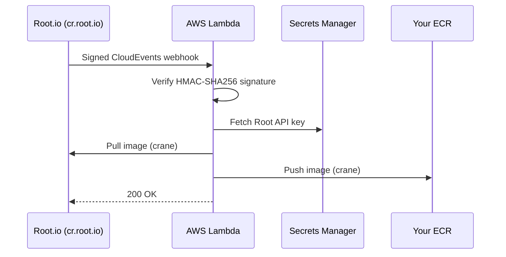
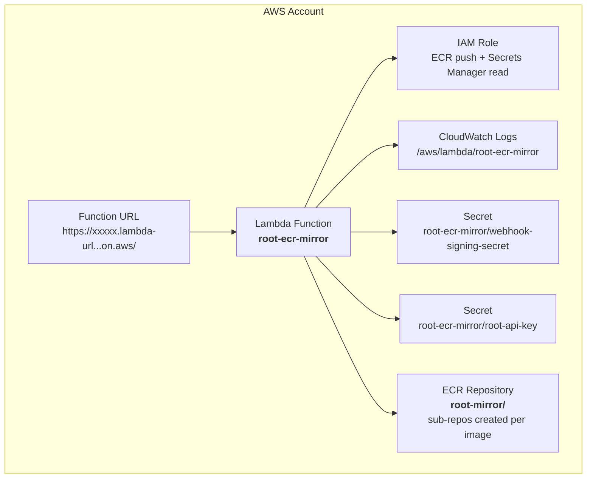

# ecr-mirror-lambda

Automatically mirror [Root](https://root.io) remediated container images into your Amazon ECR — no polling, no manual steps.

When Root patches a vulnerability and pushes a new image tag, this Lambda receives a webhook, verifies its authenticity, and copies the image straight into your ECR. Deploy it once with Terraform and forget about it.

## How It Works



1. Root finishes remediating an image and sends a signed [CloudEvents](https://cloudevents.io/) webhook
2. The Lambda verifies the [Standard Webhooks](https://www.standardwebhooks.com/) HMAC-SHA256 signature
3. If valid, it copies the image from `cr.root.io` to your ECR using [crane](https://github.com/google/go-containerregistry)

No long-lived credentials — the Lambda uses its IAM role for ECR and reads secrets from AWS Secrets Manager.

## Prerequisites

- **AWS CLI** — configured with an active profile ([install guide](https://docs.aws.amazon.com/cli/latest/userguide/getting-started-install.html))
- **Terraform** >= 1.5 / **OpenTofu** >= 1.5 ([Terraform install](https://developer.hashicorp.com/terraform/install) | [OpenTofu install](https://opentofu.org/docs/intro/install/))
- **AWS provider** `hashicorp/aws` ~> 5.0
- **Docker** ([install guide](https://docs.docker.com/get-docker/))
- **A Root account** with an API key

## Getting Started

The whole setup takes about 5 minutes.

### Step 1: Clone this repo

```sh
git clone https://github.com/root-io/ecr-mirror-lambda.git
cd ecr-mirror-lambda
```

### Step 2: Build and push the Lambda image

Replace `<ACCOUNT_ID>` and `<REGION>` with your values:

```sh
export AWS_ACCOUNT_ID=123456789012
export AWS_REGION=us-east-1

# Log in to ECR
aws ecr get-login-password --region $AWS_REGION | \
  docker login --username AWS --password-stdin $AWS_ACCOUNT_ID.dkr.ecr.$AWS_REGION.amazonaws.com

# Create a repo for the Lambda image (one-time)
aws ecr create-repository --repository-name root-ecr-mirror-lambda --region $AWS_REGION

# Build and push (--provenance=false is required for Lambda compatibility)
docker buildx build --platform linux/amd64 --provenance=false --sbom=false \
  --output type=docker \
  -t $AWS_ACCOUNT_ID.dkr.ecr.$AWS_REGION.amazonaws.com/root-ecr-mirror-lambda:latest .
docker push $AWS_ACCOUNT_ID.dkr.ecr.$AWS_REGION.amazonaws.com/root-ecr-mirror-lambda:latest
```

> **Note:** Lambda only supports Docker v2 manifests. The `--provenance=false --sbom=false` flags prevent Docker BuildKit from producing OCI manifests that Lambda rejects.

### Step 3: First deploy — get the webhook URL

```sh
cd terraform/
cp terraform.tfvars.example terraform.tfvars
```

Open `terraform.tfvars` and fill in your values. Leave `webhook_signing_secret` empty for now — you'll get it in Step 4:

```hcl
aws_region       = "us-east-1"
dst_repo         = "root-mirror"
lambda_image_uri = "123456789012.dkr.ecr.us-east-1.amazonaws.com/root-ecr-mirror-lambda:latest"

webhook_signing_secret = ""   # fill in after Step 4
root_api_key           = "root_..."
```

Deploy:

```sh
terraform init
terraform apply
```

When it finishes, note the `webhook_url` output:

```
webhook_url        = "https://xxxxx.lambda-url.us-east-1.on.aws/"
ecr_repository_url = "123456789012.dkr.ecr.us-east-1.amazonaws.com/root-mirror"
```

### Step 4: Register the webhook in Root

Copy the `webhook_url` and create a webhook subscription in Root:

```sh
curl -X POST https://api.root.io/v3/settings/webhooks \
  -H "Authorization: Bearer <your-token>" \
  -H "Content-Type: application/json" \
  -d '{
    "url": "https://xxxxx.lambda-url.us-east-1.on.aws/",
    "description": "Mirror to ECR",
    "event_types": ["io.root.cr.image.created.v1"]
  }'
```

The response includes a `secret` field.

### Step 5: Second deploy — set the signing secret

Paste the secret into `terraform.tfvars`:

```hcl
webhook_signing_secret = "whsec_..."
```

Then apply again:

```sh
terraform apply
```

That's it. Every new Root remediated image will now automatically appear in your ECR.

## Verifying It Works

**Watch the logs:**

```sh
aws logs tail /aws/lambda/root-ecr-mirror --follow
```

On a successful mirror, you'll see:

```
INFO received event  webhook_id=whmsg_... event_id=evt_... type=io.root.cr.image.created.v1 image_repo=library/nginx image_tag=1.25.4-amd64-root
INFO copying image   webhook_id=whmsg_... src=cr.root.io/library/nginx:1.25.4-amd64-root dst=123456789012.dkr.ecr.us-east-1.amazonaws.com/root-mirror/library/nginx:1.25.4-amd64-root
INFO image copied successfully  webhook_id=whmsg_...
```

**Check ECR:**

```sh
aws ecr list-images --repository-name root-mirror/library/nginx --region us-east-1
```

## Teardown

To remove everything:

```sh
cd terraform/
terraform destroy
```

This cleanly deletes the Lambda, IAM role, secrets, ECR repository, CloudWatch log group, and Function URL.

## Configuration

### Terraform Variables

| Variable | Required | Default | Description |
|----------|----------|---------|-------------|
| `aws_region` | No | `us-east-1` | AWS region to deploy into |
| `dst_repo` | No | `root-mirror` | Base ECR repository name. Images appear as `<dst_repo>/<image_name>:<tag>` |
| `lambda_image_uri` | **Yes** | — | ECR URI of the built Lambda container image |
| `root_registry_host` | No | `cr.root.io` | Root registry hostname |
| `webhook_signing_secret` | No | `""` | HMAC signing secret from your Root webhook subscription. Empty on first apply; set after Step 4 |
| `root_api_key` | **Yes** | — | Root API key for pulling images from the Root registry |
| `allowed_repos` | No | `[]` | Allowlist of image repos to mirror (e.g. `["python", "golang"]`). When empty, all repos are mirrored |
| `log_retention_days` | No | `14` | CloudWatch log retention in days |

### Repo Allowlist

By default, the Lambda mirrors every image repo that Root notifies it about. To restrict mirroring to a specific set of repos, set `allowed_repos` in `terraform.tfvars`:

```hcl
allowed_repos = ["python", "golang", "node"]
```

Events for repos not in the list are acknowledged with a 200 and silently ignored.

### Sub-repo Creation

When a new image arrives for a repo that doesn't yet exist in ECR (e.g. `root-mirror/python`), the Lambda creates it automatically and copies the following settings from the base repo (`root-mirror`):

- **Repository policy** (pull/push permissions)
- **Lifecycle policy** (image expiry rules)

If the base repo has no policy or lifecycle rule set, the new sub-repo is created without one. Repos that already exist are left untouched.

### Outputs

| Output | Description |
|--------|-------------|
| `webhook_url` | Lambda Function URL — paste this into Root's webhook settings |
| `ecr_repository_url` | ECR repository where mirrored images are pushed |

## What Gets Deployed



## Security

| Protection | How |
|-----------|-----|
| **Signature verification** | Every webhook is verified against HMAC-SHA256 ([Standard Webhooks](https://www.standardwebhooks.com/) spec) |
| **Replay protection** | Requests with timestamps older than 5 minutes are rejected |
| **No long-lived credentials** | ECR auth via IAM role; secrets in Secrets Manager |
| **Minimal IAM** | Lambda can only push to its target ECR repo and read its two secrets |
| **Timing-safe comparison** | HMAC verified with `hmac.Equal` to prevent timing attacks |
| **Event filtering** | Only `io.root.cr.image.created.v1` events are processed |
| **Repo allowlist** | Optional `allowed_repos` list restricts which image repos are mirrored |

## Troubleshooting

**Lambda Function URL returns 403 Forbidden:**
If your AWS account is part of an AWS Organization, a Service Control Policy (SCP) may block public Lambda Function URLs. Check with your infrastructure team, or consider placing API Gateway in front of the Lambda.

**Docker build produces OCI manifests:**
Lambda only supports Docker v2 manifests. Always build with `--provenance=false --sbom=false`. Verify the manifest type after pushing:

```sh
aws ecr describe-images --repository-name root-ecr-mirror-lambda \
  --query 'imageDetails[].imageManifestMediaType'
# Expected: ["application/vnd.docker.distribution.manifest.v2+json"]
```

**`image copy failed` in logs:**
Check that the image actually exists on `cr.root.io` and that your Root API key has pull access. You can verify with:

```sh
aws logs tail /aws/lambda/root-ecr-mirror --since 5m
```

## License

Apache License 2.0 — see [LICENSE](LICENSE) for details.
